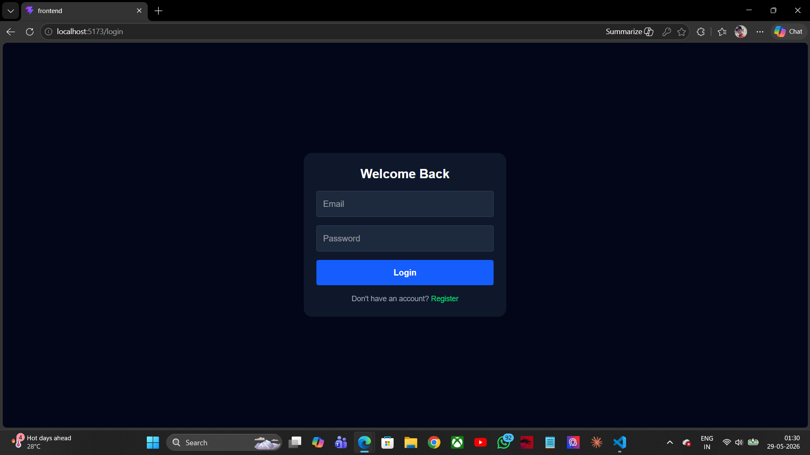
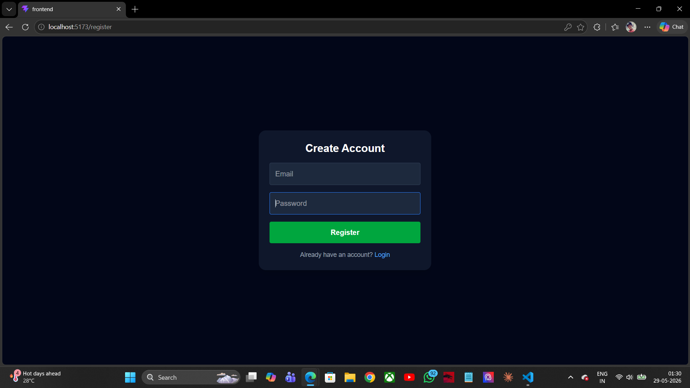
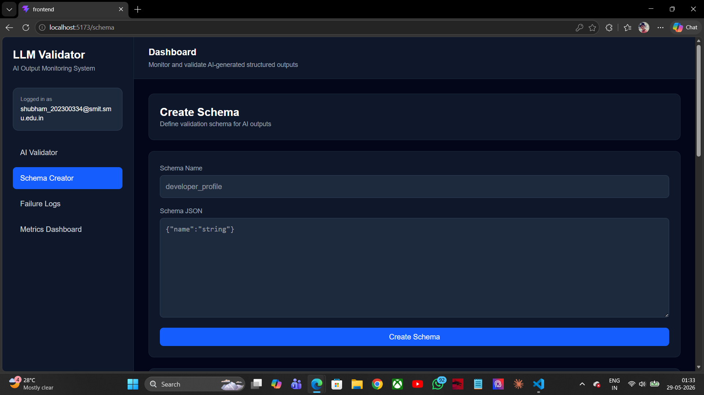
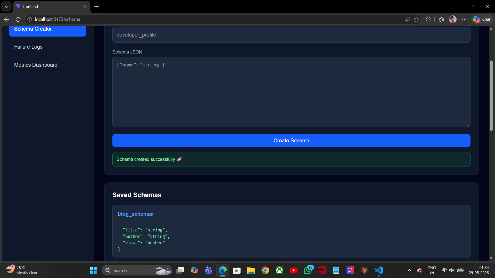
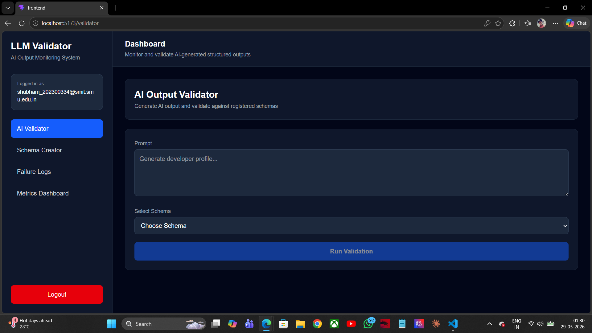
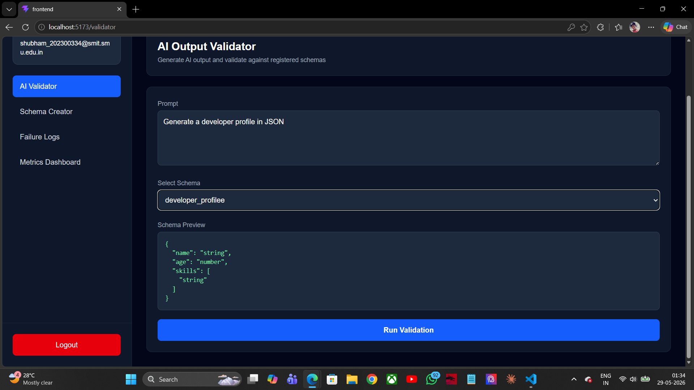
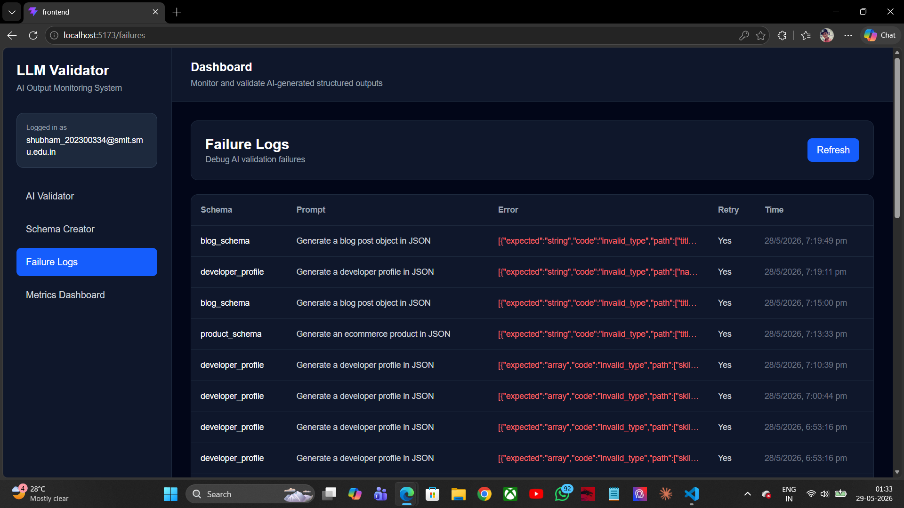
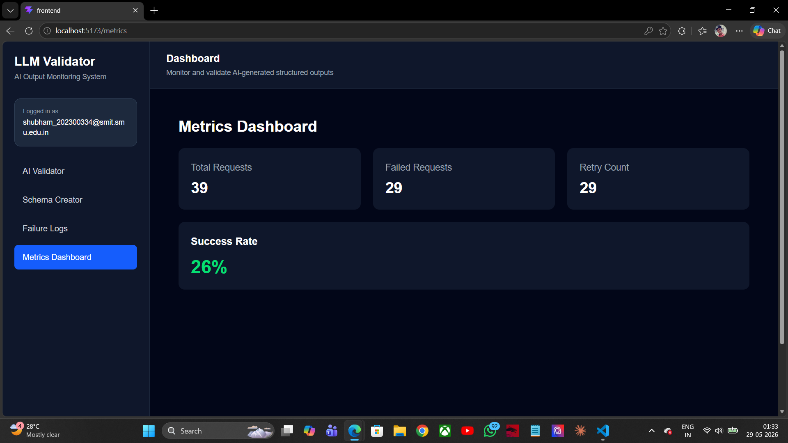
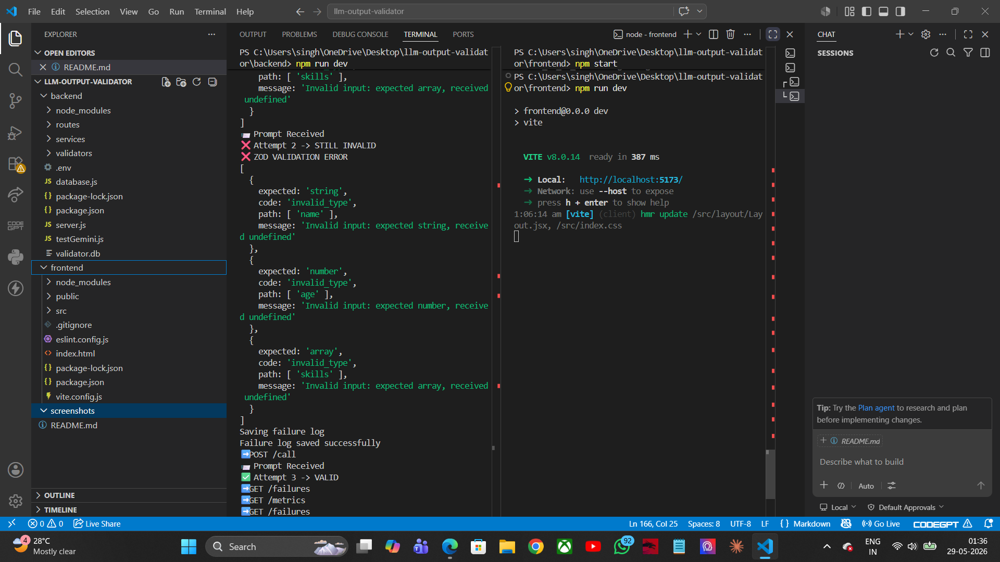

🚀 LLM Output Validator
A full-stack AI-powered JSON validation system with schema enforcement, retry logic, failure logging, and analytics dashboard.

Built with React, Node.js, Express, SQLite, and Zod.

✨ Features
🔐 Authentication
User Registration
User Login
Protected Routes
Persistent Authentication
Logout System
📦 Schema Management
Create JSON Schemas
Store Schemas in SQLite
Fetch Registered Schemas
Schema Preview
🤖 AI Output Validation
Generate AI Responses
Validate Responses Against Schemas (Zod)
Retry Failed Outputs Automatically
Strict JSON Validation
Latency Tracking
📊 Failure Monitoring
Log Validation Failures
Track Retry Attempts
Store Validation Errors
View Failure History
📈 Metrics Dashboard
Total Requests
Failed Requests
Retry Count
Success Rate Analytics
🛠️ Tech Stack
Frontend
React.js
React Router DOM
Tailwind CSS
Axios
React Hot Toast
Backend
Node.js
Express.js
SQLite3
JWT Authentication
bcryptjs
Zod Validation
📁 Project Structure
llm-output-validator/ │ ├── backend/ │ ├── routes/ │ ├── services/ │ ├── validators/ │ ├── database.js │ ├── server.js │ └── validator.db │ ├── frontend/ │ ├── src/ │ │ ├── api/ │ │ ├── components/ │ │ ├── context/ │ │ ├── layout/ │ │ ├── pages/ │ │ └── App.jsx │ └── README.md

⚙️ Installation & Setup
1. Clone Repository
git clone https://github.com/shubham99557/llm-output-validator
cd llm-output-validator
🔥 Backend Setup
cd backend
npm install
node server.js

Backend runs at:

http://localhost:5000
🎨 Frontend Setup
cd frontend
npm install
npm run dev

Frontend runs at:

http://localhost:5173
📡 API Routes
🔐 Authentication
Method	Route	Description
POST	/auth/register	Register user
POST	/auth/login	Login user
📦 Schemas
Method	Route	Description
POST	/schemas	Create schema
GET	/schemas	Get all schemas
🤖 Validation
Method	Route	Description
POST	/call	Generate + validate AI output
📊 Failures
Method	Route	Description
GET	/failures	Get validation failures
📈 Metrics
Method	Route	Description
GET	/metrics	Get analytics metrics
📄 Example Schema
{
  "name": "string",
  "age": "number",
  "skills": ["string"]
}
✅ Example Validated Output
{
  "name": "John",
  "age": 25,
  "skills": ["React", "Node.js"]
}
🔁 Retry Logic
AI output is generated
Validation is performed using Zod
If validation fails → retry prompt is triggered
AI regenerates corrected output
If retry still fails → failure is logged

# 📸 Screenshots

## Login Page

## Register Page

## Schema Creator

## AI Output Validator

## Failure Dashboard

## Metrics Dashboard

## Backend Logs

🚀 Future Improvements
Real Gemini / OpenAI API integration
JWT middleware protection
Export logs as CSV
User-specific schemas
Advanced analytics charts
Docker deployment
Role-based access system
👨‍💻 Author

SHUBHAM RAJ
B.Tech CSE
Sikkim Manipal Institute of Technology